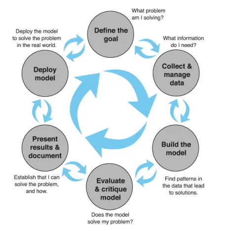
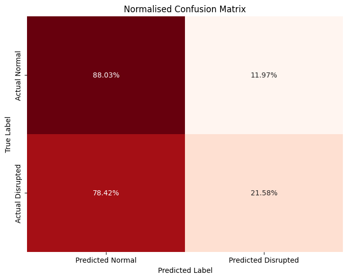
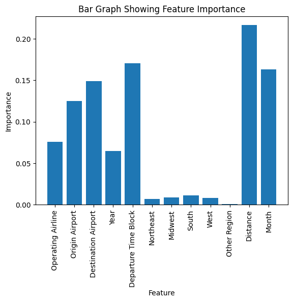
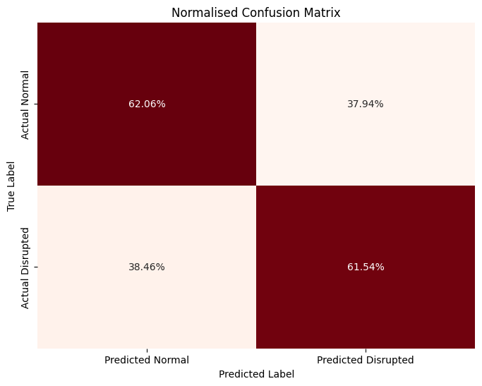

## Flight Disruption Predictor [[view code]](https://github.com/ejml1/Flight-Distruption-Predictor/blob/main/flight_disruption_prediction.ipynb) 


<p align ="center">
    
</p>

<p align="center">
    <a href="#Problem Statement">Problem Statement</a> •
    <a href="#Dataset">Dataset</a> •
    <a href="#Methodology">Methodology</a> •
    <a href="#Training Performance and Insights">Training Performance and Insights</a> •
    <a href="#Final Model">Final Model</a> •
    <a href="#Future Work">Future Work</a>
</p>

<a id = 'Problem Statement'></a>
## Problem Statement

Investigate a real-world dataset involving flight information within the US and
its territories and create a model using machine learning techniques to predict whether a flight will suffer
from a disruption. 

<a id = 'Dataset'></a>
## Dataset

The original dataset is a subset of the [Flight Status Prediction](https://www.kaggle.com/datasets/robikscube/flight-delay-dataset-20182022) found on Kaggle

The attributes used in this project are:

1. Year
2. Month
3. DayOfWeek
4. DepTimeBlk
5. ArrTimeBlk
6. Operating_Airline
7. Distance
8. OriginAirportID
9. DestAirportID
10. OriginState

<a id ='Methodology'></a>
## Methodology

<p align ="center">
    
</p>

A subset of the ML project structure was followed. This consisted of
exploring the data to learn about potential patterns that might affect disruption, manipulating the data to a format
for the various machine learning models to train on, finding ways to improve the model, and then evaluating and
critiquing the model on unseen data.

<a id ='Training Performance and Insights'></a>
## Training Performance and Insights

For the baseline model, I used the DecisionTreeClassifier. It performed slightly worse than the RandomForestClassifier but was significantly faster to train. After training the DecisionTreeClassifier, I had an accuracy of
75%. However, this is misleading as it is not well representative of the business aims as due to the model
predicting that a flight was not disrupted. 78% of the disrupted flights were predicted to be not disrupted. 

<p align ="center">
    
</p>


It is highly likely this is due to the imbalance of data favouring the non-disrupted class. Therefore balanced
accuracy would be a better metric than accuracy, with this base model having 55%. I
believe that it is more important to predict that a flight will be disrupted than not disrupted. This is because in
most cases, people are going to assume that their flight will not suffer any type of disruption, so this information is
mostly not needed. It would therefore be more useful for potential users to predict whether their flight would be
disrupted so that they could potentially account for longer travel. Even if a non-disrupted flight is predicted to be
disrupted, I believe for users to find this out on the day would not cause any negative effects whereas if a user
were to find that a flight predicted to be not disrupted was disrupted, their trust in using the model would
decrease.

In an attempt to combat this imbalance, I tried to increase the weight of the disrupted class to influence the
classification during training.

```Python
param_grid = [
    {
        'class_weight': [{0: 1, 1: 1}, {0: 1, 1: 2}, {0: 1, 1: 4}, {0: 1, 1: 8}],
        'max_depth': [None, 20, 40],
        'criterion': ['gini', 'entropy'],
        'min_samples_split': [2, 4, 8]
    }
]
```

Another insight gained through training is that the region in which a flight takes off is not important to the model,
thus it was removed as an attribute when fine-tuning the model.

<p align ="center">
    
</p>

<a id ='Final Model'></a>
## Final Model

Despite the overall accuracy being lower (62%), balanced accuracy improved to 62%. Recall also
improved from 21% to 62% but with a slight drop in precision from 31% to 29%. This gives a final F1-Score of
39%, 14% better than the initial model. This model as a whole fits the business objective better as 62% of the
disrupted flights are now being correctly predicted in comparison to the initial solution of 22%. However, this
model is limited as only ⅖ are still being incorrectly assigned, meaning there is a large room for improvement. 

<p align ="center">
    
</p>

<a id = 'Future Work'></a>
## Future Work

As the dataset is heavily imbalanced, future work can involve methods to balance training data as this could lead to significant improvements in the performance of the model.